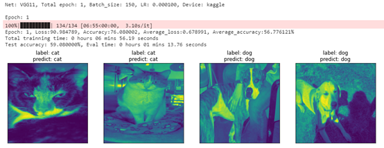

# Cat_Dog_Classification
Simple deep learning exercise base on pytorch and VGG net.

### Install requirements
```python
pip install -r requirements.txt
```

### Command line
```python
python train.py --help
```
```python
usage: train.py [-h] [--device DEVICE] [--batch_size BATCH_SIZE]
                [--epoch EPOCH] [--lr LR] [--record_epoch RECORD_EPOCH]
                [--vgg_net VGG_NET] [--one_hot ONE_HOT]
                [--show_picture_num SHOW_PICTURE_NUM]
                [--dataset_path DATASET_PATH] [--rgb RGB] [--csv CSV]
                [--show_valid SHOW_VALID]

Training config

optional arguments:
  -h, --help            show this help message and exit
  --device DEVICE       Use my device or colab or kaggle to train, you can
                        choose kaggle, colab, my_device or other
  --batch_size BATCH_SIZE
                        Batch size for trainning
  --epoch EPOCH         Trainning epoch
  --lr LR               Learning rate
  --record_epoch RECORD_EPOCH
                        Record pth files how many epochs
  --vgg_net VGG_NET     Choose net to train the model, you can choose 11,
                        11-LRN, 13, 16, 16-1, 19
  --one_hot ONE_HOT     Use one hot type to train or not
  --show_picture_num SHOW_PICTURE_NUM
                        During test period show how many picture
  --dataset_path DATASET_PATH
                        Dataset path, not include train or test path
  --rgb RGB             Use rgb mode to show picture or not
  --csv CSV             Create csv submission file or not
  --show_valid SHOW_VALID
                        Can not show test and valid at same time on kaggle
```
### Use kaggle
- Add this dataset to kaggle jupyter notebook 
  https://www.kaggle.com/biaiscience/dogs-vs-cats

- Copy following command to kaggle jupyter and train the model.

```python
!git clone https://github.com/WuDzzz/Cat_Dog_Classification_Demo.git
!nvidia-smi
```
```python
%run ./cat_dog_classification/train.py --batch_size 150 --epoch 20 --device kaggle --vgg_net 11 --csv True
```

### Result
On kaggle, can not show test picture and valid picture at same time, default show test picture, and can not show valid picture, but you can show both pictures on your local device.


### Reference
- https://magolor.cn/2020/01/14/2020-01-14-blog-01/#vgg%E7%BB%93%E6%9E%84
- http://tangshusen.me/Dive-into-DL-PyTorch/#/